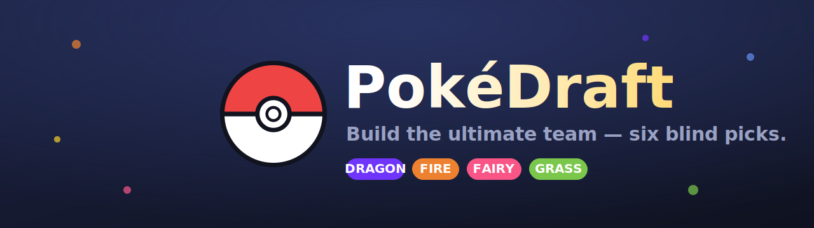

<p align="center">
  
</p>

<h1 align="center">PokéDraft</h1>

<p align="center">
  A blind team-drafting game for Pokémon, inspired by the viral NBA game
  <a href="https://databallr.com/sixrings"><strong>SixRings</strong></a>.<br/>
  Draft six Pokémon with their stats hidden, then see how your team ranks.
</p>

---

## How to play

You build a team of **6 Pokémon**, one round at a time:

1. Each round reveals a **random type** (of the 18) and deals you **15 Pokémon** of that type.
2. The catch — **Base Stat Totals are hidden.** You pick the one you *think* is strongest.
3. No duplicates: once a Pokémon joins your team, it's out of the pool.
4. After six picks, your team is scored and ranked into a tier.

### Lifelines

Spend these wisely across the draft:

| Lifeline | Uses | Effect |
|---|---|---|
| 🔄 **Switch Type** | 2 | Reroll the round's type and deal a fresh 15. |
| 🎴 **Redeal** | 3 | Deal 15 new Pokémon of the same type. |
| 📊 **Reveal BST** | 2 | Show every card's Base Stat Total this round. |
| 🔍 **Spyglass** | 3 | Reveal the stats of a single Pokémon. |

### Scoring

Your final team is graded out of 100 on three axes, then ranked
**Youngster → Gym Leader → Elite Four → Champion → Pokémon Master**:

- **Strength** — total Base Stats of your six picks.
- **Defensive synergy** — how the team collectively resists, is immune to, or stacks weaknesses against all 18 attacking types.
- **Offensive coverage** — how many of the 18 types your team threatens super-effectively.

> Scoring weights are an intentionally tunable **v1** — see [`src/game/scoring.ts`](src/game/scoring.ts).

## Tech

- **Vite + React + TypeScript**, deployed on **Vercel**.
- Fully static gameplay — **zero runtime API calls.** All Pokémon and type-matchup data is pre-baked from [PokéAPI](https://pokeapi.co) into `src/data/` by a one-time fetch script.

## Local development

```bash
npm install
npm run dev          # start the dev server (http://localhost:5173)
npm run build        # typecheck + production build to dist/
npm run preview      # preview the production build
npm run fetch-data   # re-pull Pokémon + type data from PokéAPI (regenerates src/data/)
```

## Project structure

```
scripts/fetchData.mjs   # PokéAPI -> src/data/*.json (run once)
src/data/               # pre-baked datasets (1025 Pokémon, 18 types)
src/game/               # game state machine, scoring, type effectiveness
src/components/         # cards, lifelines, team tray, results
src/App.tsx             # screen composition
```

## Roadmap

PokéDraft is being built toward a full online game. Planned, not yet shipped:

- [ ] **Global leaderboard** + persisted scores (Vercel serverless functions + a database)
- [ ] **Daily challenge** — everyone gets the same type sequence each day
- [ ] **Shareable score cards** (Wordle-style) to post your result
- [ ] **Smogon competitive tiers** folded into the strength score
- [ ] User accounts and a personal stats history

---

<p align="center"><sub>Pokémon data courtesy of <a href="https://pokeapi.co">PokéAPI</a>. This is a fan project, not affiliated with Nintendo / Game Freak / The Pokémon Company.</sub></p>
